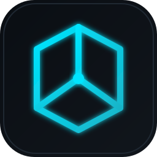
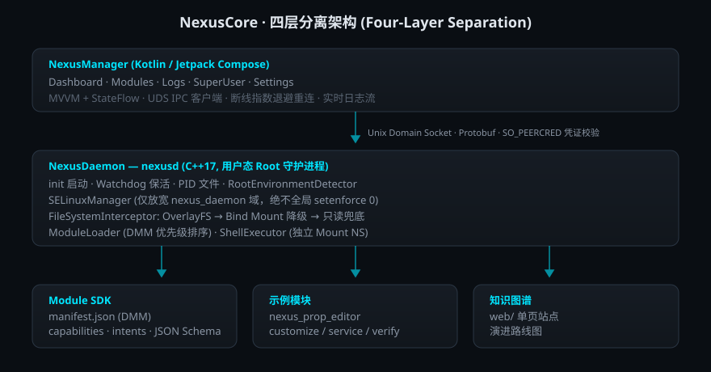

<div align="center">
  
  <h1>AutoVeil · NexusCore</h1>
  <p>User-space Root framework for Android 14–16 · Four-layer separation · Zero-bootloop design</p>

  
  
  
  
  
  
  
  
  
</div>

<p align="center">
  <a href="./README.md">简体中文</a> · English
</p>

---

## 📖 Overview

**AutoVeil / NexusCore** is a user-space Root framework targeting Android 14 / 15 / 16. It uses a strict four-layer separation architecture: a C++ Root daemon `nexusd`, a Kotlin/Compose manager client, a module developer SDK, and a knowledge-atlas web site.

It tackles the three hardest problems in system-level Root modification: **bootloop risk**, **SELinux enforcement conflicts**, and **module conflicts & capability abuse**.

- 🛡️ **Zero bootloop** — user-space syscalls only, no kernel modules; every syscall failure has a fallback; 3 consecutive failed boots trigger safe mode.
- 🔐 **Least-privilege SELinux** — patches only the `u:r:nexus_daemon:s0` domain, never a global `setenforce 0`.
- 🧩 **Declarative Module Manifest (DMM)** — modules declare capabilities & intents; **undeclared capabilities are always denied**.
- 🔌 **Process isolation** — all module scripts run in a dedicated Mount Namespace.
- 📡 **Secure IPC** — Unix Domain Socket + Protobuf + `SO_PEERCRED` credential check + APK signature fingerprint.
- 🎨 **Native Compose UI** — Material3 dark theme, edge-to-edge, real-time log streaming.

> The primary documentation is in **Simplified Chinese** ([README.md](./README.md)). This English page is a concise summary.

---

## 🏛️ Architecture

<div align="center">
  
</div>

| Layer | Language | Responsibility |
|---|---|---|
| **NexusManager** | Kotlin / Compose | Dashboard, modules, logs, superuser, settings; IPC client only |
| **NexusDaemon (nexusd)** | C++17 | init-started Root daemon: SELinux patch, FS interception, module loader, IPC server |
| **Module SDK** | JSON Schema / Shell | DMM spec, capabilities whitelist, script runtime conventions |
| **Web atlas** | HTML/CSS | single-page site for architecture & roadmap |

**Boot sequence**: `init → nexusd --daemon → RootEnvironmentDetector → SELinuxManager.patchSelfDomain → ModuleLoader.scanModules → FileSystemInterceptor.mountAll → IpcServer.listen → late_start scripts → Watchdog main loop`

---

## ✨ Highlights

- **Daemon**: double-fork daemonize + PID file, thread-level Watchdog, auto-detect Magisk / KernelSU / APatch, three-tier FS fallback `OverlayFS → Bind Mount → read-only Noop`.
- **Security**: `BootCounter` auto-enables safe mode after 2 failed boots; `last_mounts.json` snapshot for rollback; triple IPC credential check.
- **Manager**: MVVM + StateFlow, all IPC on `Dispatchers.IO`, exponential-backoff reconnect (500ms → 15s + jitter), 2000-line sliding-window log stream.
- **Module SDK**: `manifest.json` (DMM), capability whitelist (`EXECUTE_SHELL`, `MODIFY_SYSTEM_PROPS`, `MOUNT_FILESYSTEM`, …), 5 script stages, env-var injection, sample module `nexus_prop_editor`.

---

## 🚀 Quick Start

**Requirements**: Android Studio Hedgehog+ · JDK 17 · Android SDK 35 · NDK r26d+ · CMake ≥ 3.22

```bash
git clone https://github.com/AceGuru-mjh/AutoVeil.git
cd AutoVeil

# NexusManager APK
cd nexuscore/manager
chmod +x ./gradlew
./gradlew :app:assembleDebug
# -> nexuscore/manager/app/build/outputs/apk/debug/app-debug.apk

# nexusd daemon (needs NDK)
cd ../daemon
./build.sh arm64-v8a          # -> build-arm64-v8a/nexusd
```

Prebuilt binaries: see [Releases](https://github.com/AceGuru-mjh/AutoVeil/releases).

---

## 📚 Specs

The architecture is strictly defined by three spec documents (in Chinese). Any PR must respect their "hard constraints":

- [Spec 01 — Daemon](./nexuscore/specs/spec-01-daemon.md) — boot sequence, SELinux patch, FS interception, IPC protocol, safe mode
- [Spec 02 — NexusManager](./nexuscore/specs/spec-02-manager.md) — IPC client, repository, viewmodels, Compose UI
- [Spec 03 — Module SDK](./nexuscore/specs/spec-03-module-sdk.md) — DMM, capabilities, script runtime, sample module
- [Module developer guide](./nexuscore/sdk/docs/developer-guide.md)

---

## 🤝 Contributing

Contributions are welcome — please read [CONTRIBUTING.md](./CONTRIBUTING.md) first. Open an issue for large changes, branch from `main` (`feat/...` or `fix/...`), follow [Conventional Commits](https://www.conventionalcommits.org/), and fill in the [PR template](./.github/PULL_REQUEST_TEMPLATE.md) including the hard-constraint self-check.

Bug reports should include: device model, Android version, root provider (Magisk/KSU/APatch) & version, FS interceptor type, reproduction steps, and logs (`adb shell cat /data/adb/nexuscore/nexusd.log`).

---

## 📄 License

Licensed under the **MIT License with Non-Commercial Clause**, Copyright © 2026 AutoVeil / NexusCore Contributors. See [LICENSE](./LICENSE).

**In short**:
- ✅ **Allowed**: personal study, research, teaching, non-profit community use, contributing PRs, personal forks
- ❌ **Prohibited**: any commercial use (selling, paid SaaS, bundling with commercial products, internal enterprise use for profit) — requires separate written license
- 📋 Derivatives must retain the MIT text + Non-Commercial Clause + original copyright

MIT-NC is chosen over plain MIT to **prevent commercial repackaging** (a common abuse in the Root ecosystem where open tools get resold as paid products), and over GPL to **lower the barrier for module developers** — Magisk module authors can build on NexusCore without copyleft concerns, the lightweight license model most common in the Android Root ecosystem.

> ⚠️ This project performs system-level Root operations. Use at your own risk — the authors are not liable for device damage, data loss, or bootloops. Read the "Risks & Mitigations" sections of each spec and validate on a test device first.
